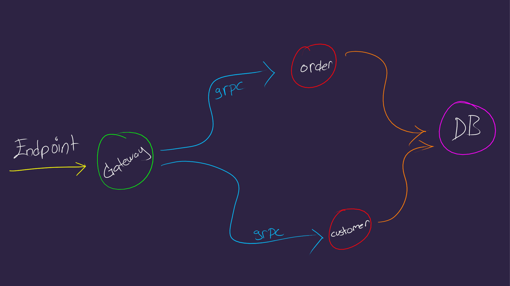

# Yet another gRPC example written in Go

### Endpoint > gateway > ( order | customer ) > DB

#### Diagram:
- Order service 
- Customer service 
- Gateway service
- Used AWS dynamoDB local version as database




## Dependencies
- docker
- docker-swarm

## Usage:

```shell

git clone https://github.com/canack/grpc-example-go.git
cd grpc-example-go
docker-compose up # Starts all services 

# After than a short time, you can test with this url : http://localhost:3434/swagger/index.html

# To close and remove all services:
# CTRL + C
docker-compose down
```


---
## License

[MIT](https://choosealicense.com/licenses/mit/)

###### Feel free to contribute !